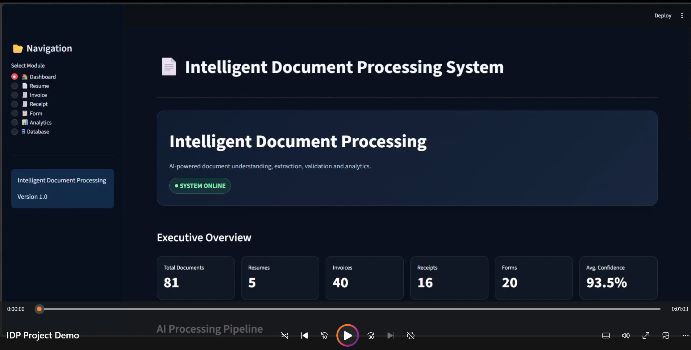

# 🤖 AI Intelligent Document Processing System

An AI-powered **Intelligent Document Processing (IDP)** system that automates the extraction, processing, analysis, and structuring of information from unstructured documents.

The system combines **Computer Vision, Optical Character Recognition (OCR), Natural Language Processing (NLP), Machine Learning, and Data Analytics** to transform document images into structured and meaningful information.

---

## 📌 Project Overview

Organizations process large volumes of documents such as **resumes, invoices, receipts, forms, and other business documents** every day.

Manually extracting information from these documents can be:

- Time-consuming
- Repetitive
- Error-prone
- Difficult to scale

This project provides an automated Intelligent Document Processing pipeline that allows users to upload documents, extract relevant information, process the extracted content, and analyze the results through an interactive application.

The system is designed as an end-to-end AI solution for converting unstructured document data into structured information.

---

## 🎯 Project Objectives

The main objectives of this project are:

- Automate document information extraction
- Reduce manual data entry
- Extract text from document images
- Process multiple document types
- Apply Computer Vision techniques
- Apply OCR for text extraction
- Apply NLP and Machine Learning techniques
- Convert unstructured information into structured data
- Perform document-specific information extraction
- Provide data analysis and visualization
- Provide an interactive user interface
- Support an end-to-end document processing workflow

---

## ✨ Key Features

### 📄 Document Processing

The system provides an automated pipeline for processing uploaded documents.

Key capabilities include:

- Document upload
- Document preprocessing
- Image processing
- OCR-based text extraction
- Text processing
- Information extraction
- Structured data generation
- Document analysis

---

### 👤 Resume Processing

The Resume Processing module extracts important candidate information from resumes.

Possible extracted information includes:

- Candidate name
- Contact information
- Email
- Phone number
- Skills
- Education
- Work experience
- Projects
- Other relevant resume information

The system also includes components for resume parsing, education parsing, experience extraction, and skill matching.

---

### 🧾 Invoice Processing

The Invoice Processing module extracts important information from invoices.

Extracted information may include:

- Invoice number
- Invoice date
- Vendor information
- Customer information
- Items
- Quantity
- Price
- Subtotal
- Tax
- Total amount

The extracted invoice information is converted into structured data for easier analysis and processing.

---

### 🧾 Receipt Processing

The Receipt Processing module extracts transactional information from receipts.

Possible extracted information includes:

- Receipt number
- Receipt date
- Merchant information
- Items
- Subtotal
- Tax
- Total amount

This allows receipt information to be processed automatically instead of being entered manually.

---

### 📝 Form Processing

The Form Processing module is designed to process uploaded forms and extract relevant information from form documents.

The system can:

- Process uploaded forms
- Extract text from form documents
- Identify relevant fields
- Extract field information
- Convert extracted information into structured data
- Display processed information through the application

---

## 🧠 AI / ML Components

The project combines multiple AI and Machine Learning technologies.

### Computer Vision

Computer Vision techniques are used for:

- Document image processing
- Image preprocessing
- Improving document quality
- Preparing images for OCR

### Optical Character Recognition

OCR is used to convert document images into machine-readable text.

The project supports OCR technologies including:

- Tesseract OCR
- EasyOCR

### Natural Language Processing

NLP techniques are used to process extracted text and identify meaningful information from documents.

### Machine Learning

Machine Learning components are used for tasks such as:

- Document classification
- Information processing
- Prediction
- Feature processing

### Semantic Processing

Sentence embeddings and similarity-based techniques can be used for semantic text processing and document-related matching tasks.

---
## 🎥 Project Demo

[](demo_video/IDP%20Project%20Demo.mp4)

**Click the image above to watch the full project demonstration.**
## 🏗️ System Architecture

The overall processing pipeline can be represented as:

```text
User
  ↓
Upload Document
  ↓
Document Preprocessing
  ↓
OCR Engine
  ↓
Extracted Text
  ↓
NLP / ML Layer
  ↓
┌────────────────────┬────────────────────┬────────────────────┬────────────────────┐
│ Resume Processing  │ Invoice Processing │ Receipt Processing │  Form Processing  │
└─────────┬──────────┴─────────┬──────────┴─────────┬──────────┴─────────┬──────────┘
          └────────────────────┴────────────────────┴────────────────────┘
                                   ↓
                            Structured Data
                                   ↓
                              Data Analysis
                                   ↓
                              Dashboard / UI